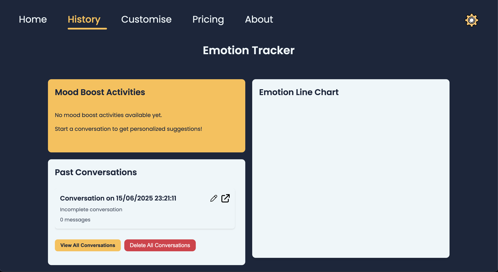

# MoodMate - Your Personalised Therapist

A comprehensive web application designed to help users track and manage their emotional well-being. This application provides features for mood tracking, personalization, and emotional support with a modern, user-friendly interface.


## Live Demo

Visit our live application at: [MoodMate](https://moodmate-1-y9lx.onrender.com/)


## Features

- **Mood Tracking**
  - Track daily emotions and moods
  - Visual mood history
  - Personalized insights

- **Customization**
  - Personalize your experience
  - Custom themes and settings
  - User preferences management

- **User Management**
  - Secure authentication
  - Profile customization
  - Privacy settings




## Tech Stack

- **Frontend**
  - HTML5, CSS3, and JavaScript
  - Custom CSS for styling
  - Responsive design for all devices

- **Backend**
  - Python (Flask) and Node.js
  - RESTful API architecture
  - Secure authentication system

## Project Structure

```
therapist/
├── assets/            # Static assets and images
├── backend/          # Server-side code
│   ├── app.py       # Python Flask application
│   ├── server.js    # Node.js server
│   └── requirements.txt  # Python dependencies
├── *.html           # HTML pages
├── *.css            # Stylesheet files
├── *.js             # JavaScript files
└── README.md        # Project documentation
```

## Available Pages

- Home (`index.html`)
- Login (`login.html`)
- About (`about.html`)
- Pricing (`pricing.html`)
- Customization (`customise.html`)
- History (`history.html`)
- Privacy Policy (`privacy.html`)

## Contributing

1. Fork the repository
2. Create your feature branch (`git checkout -b feature/AmazingFeature`)
3. Commit your changes (`git commit -m 'Add some AmazingFeature'`)
4. Push to the branch (`git push origin feature/AmazingFeature`)
5. Open a Pull Request

## License

This project is licensed under the MIT License - see the LICENSE file for details.

## Support

For support, please open an issue in the GitHub repository or contact the maintainers.

## Acknowledgments

- All contributors who have helped shape this project
- The open-source community for their invaluable tools and resources

> **Note**: This app is not an official therapist, but a supportive companion meant to offer comfort—not professional mental health advice.