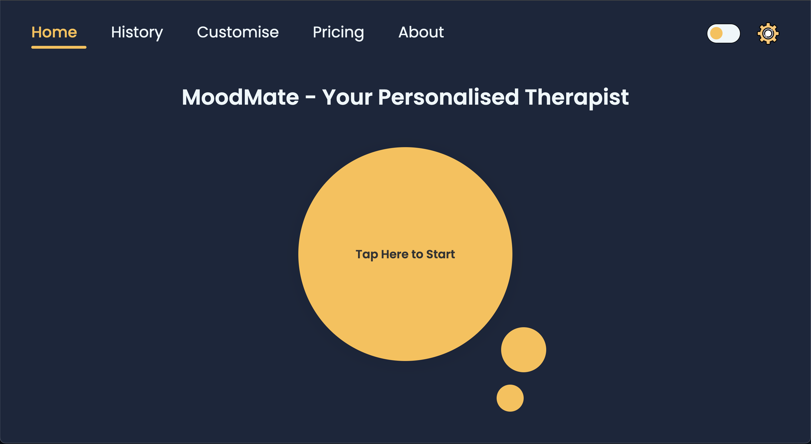
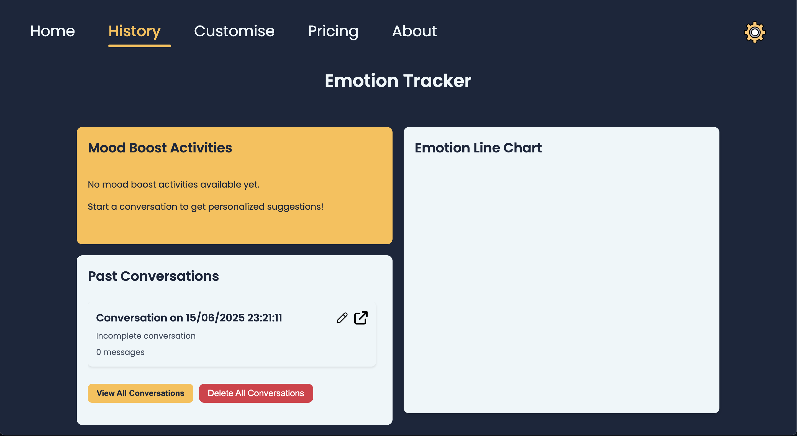

# MoodMate - Your Personalised Therapist

A comprehensive web application designed to help users track and manage their emotional well-being. This application provides features for mood tracking, personalization, and emotional support with a modern, user-friendly interface.

## Live Demo

Visit our live application at: [MoodMate](https://moodmate-1-y9lx.onrender.com/)

---

## Features

-   **Mood Tracking**
    -   Track daily emotions and moods.
    -   Visualize your mood history.
    -   Receive personalized insights to understand your emotional patterns.
-   **AI-Powered Support**
    -   Engage in conversations with an empathetic AI therapist powered by **GPT-4o**.
    -   Receive supportive and calming responses tailored to your needs.
-   **Voice Interaction**
    -   Utilizes the **Web Speech API** for both listening to you and speaking back.
    -   Choose from a dozen different voices to personalize your experience.
-   **Face Tracking Emotion Detection**
    -   Using **face-api.js**, MoodMate can detect your emotions, such as happiness, sadness, surprise, and neutrality, through your device's camera.
-   **Customization**
    -   Personalize your experience with custom themes and settings.
-   **User Management**
    -   Secure authentication and profile customization.
    -   Your privacy is a priority with dedicated privacy settings.
-   **Free Premium Plans**
    -   Currently, the **Pro and Plus plans are completely free**! Simply click on "Upgrade" to access all the premium features.

---

## Tech Stack

-   **Frontend**
    -   HTML5, CSS3, and JavaScript
    -   **face-api.js** for emotion detection
    -   **Web Speech API** for voice interaction
    -   Responsive design for all devices
-   **Backend**
    -   Python (Flask) and Node.js
    -   **OpenAI's GPT-4o** for the AI therapist
-   **Database & Deployment**
    -   Hosted on **Render**, which is also used for data persistence.
    -   A health checkpoint is continuously pinged in the Flask application to keep the Render service active and ensure the availability of the API key.

---

## Available Pages

-   Home (`index.html`)
-   Login (`login.html`)
-   About (`about.html`)
-   Pricing (`pricing.html`)
-   Customization (`customise.html`)
-   History (`history.html`)
-   Privacy Policy (`privacy.html`)

---

## Contributing

1.  Fork the repository.
2.  Create your feature branch (`git checkout -b feature/AmazingFeature`).
3.  Commit your changes (`git commit -m 'Add some AmazingFeature'`).
4.  Push to the branch (`git push origin feature/AmazingFeature`).
5.  Open a Pull Request.

---

## License

This project is licensed under the MIT License - see the LICENSE file for details.

---

## Support

For support, please open an issue in the GitHub repository or contact the maintainers.

---

## Acknowledgments

-   All contributors who have helped shape this project.
-   The open-source community for their invaluable tools and resources.

> **Note**: This app is not an official therapist, but a supportive companion meant to offer comfort—not professional mental health advice.
